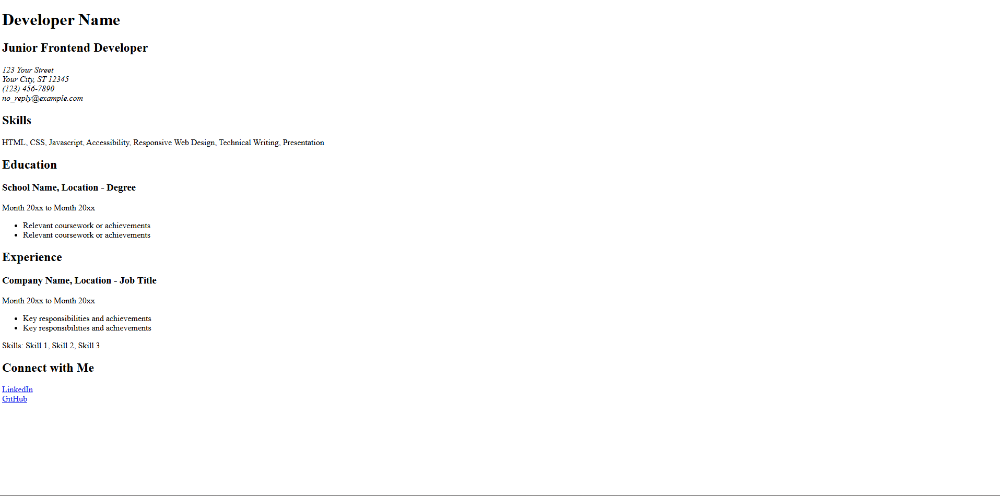
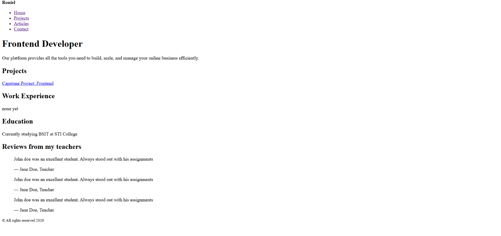
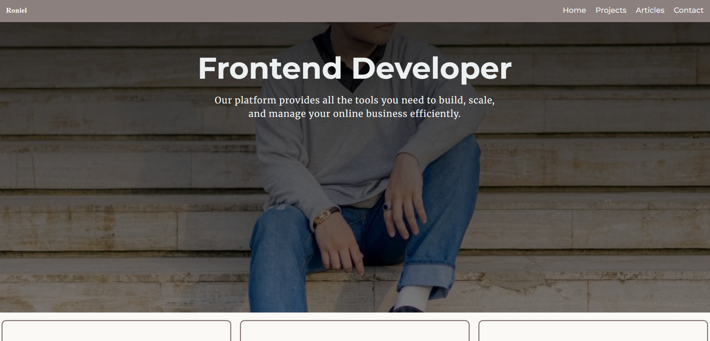
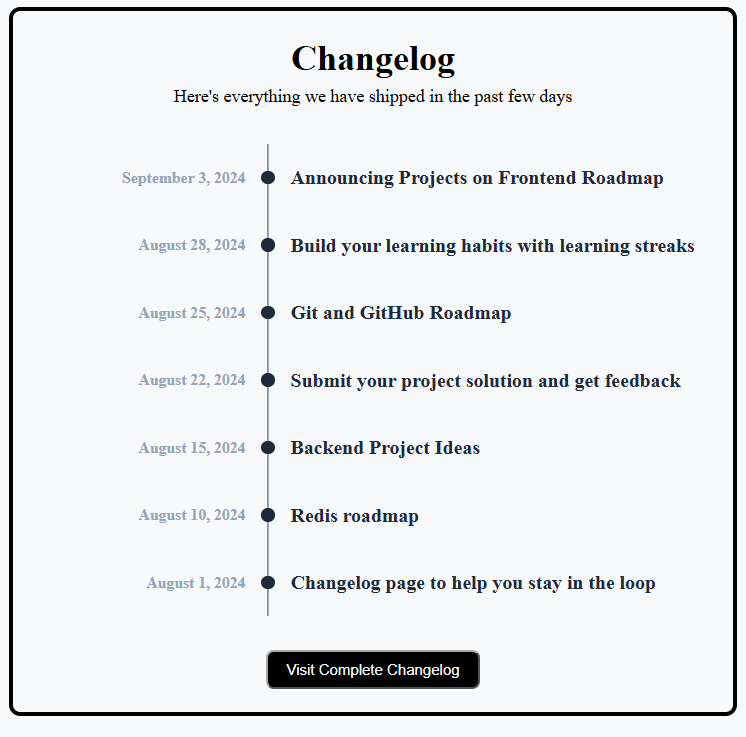

# Frontend Developer Roadmap Projects

Hey, I'm Roniel. I'm currently an IT student, and this repository is my daily practice for learning frontend development from the ground up. 

I'm following the projects from [roadmap.sh](https://roadmap.sh/).

I treat this repo like a daily training block. I wake up, write code, figure out why it broke, fix it, and push the commit before my afternoon classes start. 

## Repo Structure

I'm keeping things organized by putting projects based on their core focus, you will find each project and code in their respective folders.

## Projects

### HTML
**1. Single Page CV**
* [View Source Code](./html-projects/single-page-cv)
* [View Project Guideline](https://roadmap.sh/projects/single-page-cv)
* [🔴 Live Demo](https://rnldlcn.github.io/roadmap.sh-frontend-projects/html-projects/single-page-cv/index.html)
 

**2. Basic HTML Website**
* [View Source Code](./html-projects/basic-html-website)
* [View Project Guideline](https://roadmap.sh/projects/basic-html-website)
* [🔴 Live Demo](https://rnldlcn.github.io/roadmap.sh-frontend-projects/html-projects/basic-html-website/index.html)
 

 **3. Personal Portfolio Website**
* [View Source Code](./html-projects/personal-portfolio)
* [View Project Guideline](https://roadmap.sh/projects/portfolio-website)
* [🔴 Live Demo](https://rnldlcn.github.io/roadmap.sh-frontend-projects/html-projects/personal-portfolio/index.html)
 

 **4. Changelog Component**
* [View Source Code](./html-projects/changelog-component)
* [View Project Guideline](https://roadmap.sh/projects/changelog-component)
* [🔴 Live Demo](https://rnldlcn.github.io/roadmap.sh-frontend-projects/html-projects/changelog-component/index.html)
 
